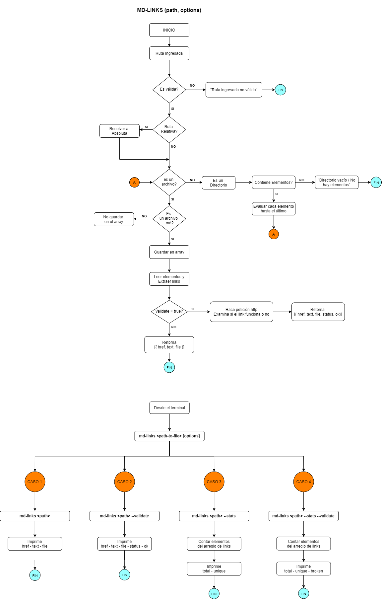
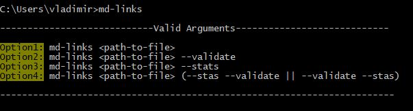
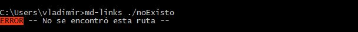

<p align="center">
  
</p>


<p align="center">
  
  
  
  
  
  
  

</p>


[Markdown](https://es.wikipedia.org/wiki/Markdown) es un lenguaje de marcado
ligero muy popular entre developers. Es usado en muchísimas plataformas que
manejan texto plano (GitHub, foros, blogs, ...), y es muy común
encontrar varios archivos en ese formato en cualquier tipo de repositorio
(empezando por el tradicional `README.md`).

Estos archivos `Markdown` normalmente contienen _links_ (vínculos/ligas) que
muchas veces están rotos o ya no son válidos y eso perjudica mucho el valor de
la información que se quiere compartir.

Éste proyecto detalla la creación de una herramienta (`library`) usando [Node.js](https://nodejs.org/),
que lea y analice archivos en formato `Markdown`, para verificar los links que 
contengan y reportar algunas estadísticas.

Tópicos: [Node.js](https://nodejs.org/en/),
[módulos (CommonJS)](https://nodejs.org/docs/latest-v0.10.x/api/modules.html),
[file system](https://nodejs.org/api/fs.html),
[path](https://nodejs.org/api/path.html),
[http.get](https://nodejs.org/api/http.html#http_http_get_options_callback),
parsing,
[markdown](https://daringfireball.net/projects/markdown/syntax), CLI,
[npm-scripts](https://docs.npmjs.com/misc/scripts),
[semver](https://semver.org/), ...


## :white_check_mark: DIAGRAMA DE FLUJO

<p align="center">
  
</p>

## :white_check_mark: INSTALACIÓN

**-Global**
```js
npm install -g dianams-md-links
```

**-Local**
```js
npm install dianams-md-links
```

## :white_check_mark: GUÍA DE USO

### :large_blue_circle: Utilízalo como módulo:

```js
const mdLinks = require('dianams-md-links');
```
#### Ejemplo:

```js
const mdLinks = require("md-links");

mdLinks("./some/example.md")
  .then(links => {
    // => [{ href, text, file }]
  })
  .catch(console.error);

mdLinks("./some/example.md", { validate: true })
  .then(links => {
    // => [{ href, text, file, status, ok }]
  })
  .catch(console.error);

mdLinks("./some/dir")
  .then(links => {
    // => [{ href, text, file }]
  })
  .catch(console.error);
```

### :large_blue_circle: Utilízalo a través de la Línea de Comandos:

`md-links <path-to-file> [options]`

#### Ejemplo:

```sh
$ md-links ./some/example.md
./some/example.md http://algo.com/2/3/ Link a algo
./some/example.md https://otra-cosa.net/algun-doc.html algún doc
./some/example.md http://google.com/ Google
```

```sh
$ md-links ./some/example.md --stats
Total: 3
Unique: 3
```

## :white_check_mark: USANDO MD-LINKS EN LA LÍNEA DE COMANDOS

### En el cmd de Windows

**- Ingresando solo md-links**

<p align="center">
  
</p>

**- Ingresando solo md-links y una ruta que no existe**

<p align="center">
  
</p>


## :white_check_mark: OBJETIVOS DE APRENDIZAJE

Recuerda colocar en esta seccion los objetivos de aprendizaje que quedaron 
pendientes de tu proyecto anterior.

### Javascript
- [ ] Uso de callbacks
- [x] Consumo de Promesas
- [x] Creacion de Promesas
- [x] Modulos de Js
- [x] Recursión

### Node
- [x] Sistema de archivos
- [x] package.json
- [x] crear modules
- [x] Instalar y usar modules
- [x] npm scripts
- [x] CLI (Command Line Interface - Interfaz de Línea de Comando)

### Testing
- [x] Testeo de tus funciones
- [x] Testeo asíncrono
- [x] Uso de librerias de Mock
- [x] Mocks manuales
- [x] Testeo para multiples Sistemas Operativos

### Git y Github
- [x] Organización en Github

### Buenas prácticas de desarrollo
- [x] Modularización
- [ ] Nomenclatura / Semántica
- [ ] Linting
